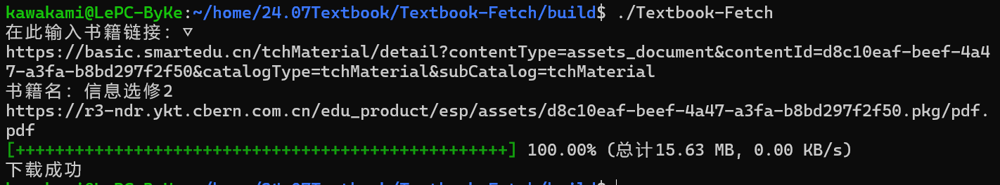

# Textbook-Fetch
辅助下载各类教材pdf文件（基于国家中小学智慧教育平台https://basic.smartedu.cn/）

<strong><em>【注意】由于生成Windows可执行文件的工作受阻，目前只支持linux用户下载调试</em></strong>

## 部署步骤（在Textbook-Fetch目录下）：

1,创建并进入 build/

    mkdir build
    cd build
2，使用cmake编译运行

    cmake ..
    make
    ./Textbook-Fetch

最后成功运行图像如下（书籍名称需自己填写，用于生成文件的命名）：

教材来源网页：https://basic.smartedu.cn/tchMaterial

下载成功后文件将位于项目目录下download/xxx.pdf